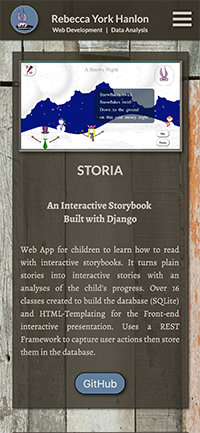
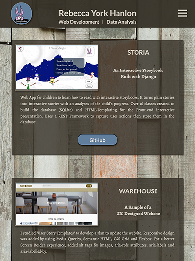
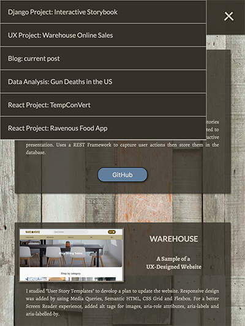
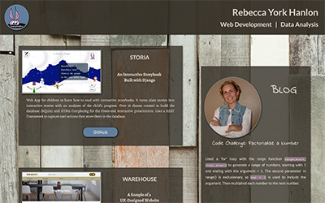

# Rebecca Hanlon's Portfolio Website
##### Project for the *Front-End Web Developer Nanodegree*

#### Introduction

**Title**: Rebecca Hanlon's Portfolio Website

This website is built to feature projects that I have developed over the past year.  It showcases each project with a brief introduction and a direct link to GitHub for further code details.

Click [here](#pictures-of-responsive-design-of-website) to see pictures of the website's Responsive Design.

##### Technical Components
- CSS Grid, Flexbox and Media Queries are used to build the _responsive features_
- `scrset` html attribute is used for image optimizations
- JavaScript (ECMASript 6) is used for user interactions:
    - clicking menu for the _project drawer_ to slide out,
    - animating the _menu hamburger_ to show open and closed status
- Semantic HTML, Aria-labels and alt tags for images are used for an enhanced Screen Reader experience
- Code snippet for menu drawer from _Lesson 14: Common Responsive Patterns Module_
- Code snippet for an animated hamburger icon from [w3schools](https://www.w3schools.com/howto/howto_css_menu_icon.asp)

#### Refactoring and Adjustments made after HTML Checker and W3C CSS Validator:
HTML:
- `srcset` showed an error because I didn't include a descriptor, so I added `1x`, `2x`, and `3x`.
- Removed all aria-roles `role=""`
- Replaced `<a>` tags with `<form>` tags.  I originally wrapped the `<button>` tags inside `<a>` tags, but got an error in the W3C CSS Validator.  I found the correct way to do at Stack Overflow utilizing `<form>` tags with the _action_ attribute

CSS:
- error _Property `justify-self` doesn't exist: `center`
- error _Property `justify-self` doesn't exist: `left`
- error _Property `justify-items` doesn't exist: `center`

I went to [MDN web docs]("https://developer.mozilla.org/en-US/docs/Web/CSS/justify-self") to verify information on `justify-self` and this property and values are available.  This choice of property seems to be working fine as is.
I also went to [MDN web docs]("https://developer.mozilla.org/en-US/docs/Web/CSS/justify-items") to verify information on `justify-items` and this property and values are available.  Seems to be working fine as is.

- `-webkit-transform` is an unknown vendor extension -- It seems that this error will show because the validator doesn't recognize it, but it can still be used.

- I ignored the `background-color` error since it didn't make sense to me.

#### Pictures of Responsive Design of Website
##### Phone

##### iPad

##### iPad with Open Drawer

##### Desk Top

